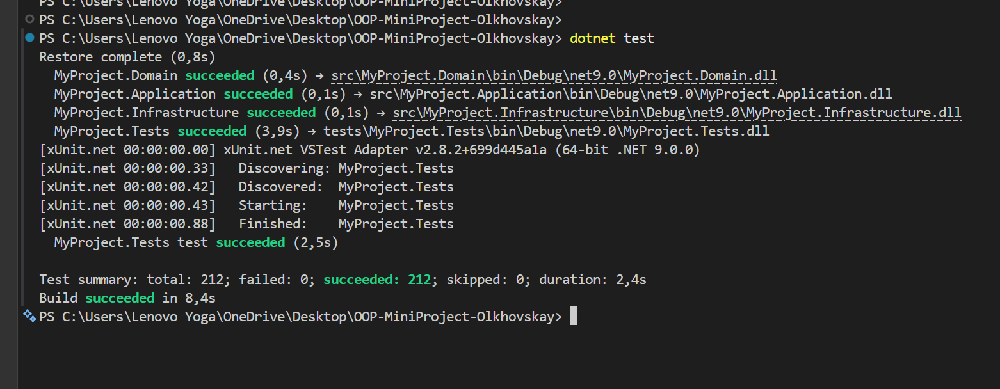
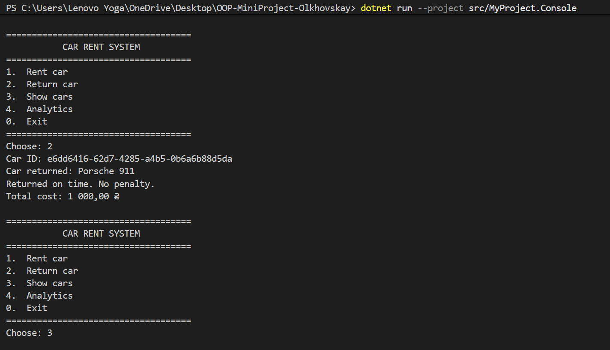
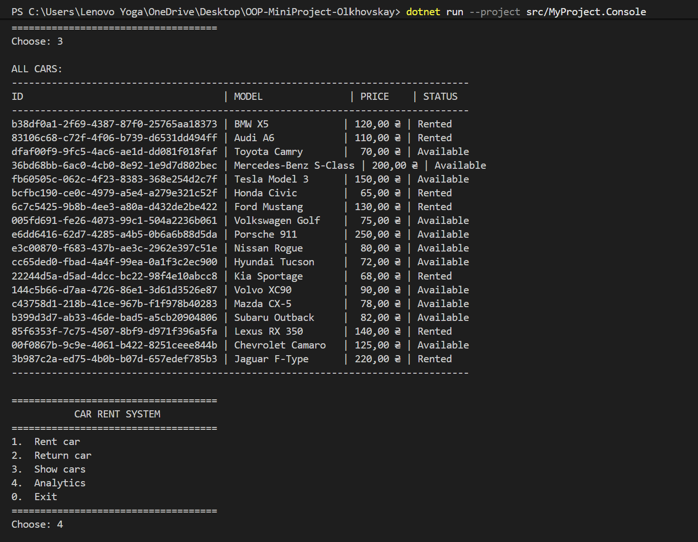

# Car Rent System
[](https://github.com/Xsessha/OOP-MiniProject-Olkhovskay/actions/workflows/dotnet.yml)
Навчальний консольний застосунок для оренди автомобілів. Проєкт показує базові теми ООП-курсу: сутності домену, наслідування, поліморфізм, інтерфейси, репозиторії, JSON persistence, LINQ-аналітику, патерни Factory/Facade/Observer та автоматизоване тестування.

## Можливості

- перегляд автопарку та статусу автомобілів;
- оренда автомобіля для `economy` або `premium` клієнта;
- повернення автомобіля з розрахунком штрафу за прострочення;
- збереження стану автопарку в `cars.json`;
- аналітика: загальний дохід і топ орендованих моделей;
- обробка очікуваних бізнес-помилок через доменні винятки;
- CI quality gate з тестами та coverage.

## Запуск

Потрібен .NET SDK 9.0.

```bash
dotnet restore
dotnet run --project src/CarRentSystem.Console/CarRentSystem.Console.csproj
```

Тести:

```bash
dotnet test tests/CarRentSystem.Tests/CarRentSystem.Tests.csproj --configuration Release
```

Coverage, як у CI:

```bash
dotnet test tests/CarRentSystem.Tests/CarRentSystem.Tests.csproj --configuration Release --no-restore /p:CollectCoverage=true /p:CoverletOutputFormat=opencover /p:CoverletOutput=TestResults\coverage\ /p:Threshold=85 /p:ThresholdType=line /p:ThresholdStat=total
```

## Структура

```text
src/
  CarRentSystem.Domain/          доменні сутності, value objects, exceptions, interfaces
  CarRentSystem.Application/     use cases, facade, analytics, factories, event bus
  CarRentSystem.Infrastructure/  JSON persistence, repositories, serialization
  CarRentSystem.Console/         консольний UI
tests/
  CarRentSystem.Tests/           unit та integration tests
docs/                        UML, release plan, coverage matrix, defense materials
```

## Документація

- [USER_GUIDE.md](USER_GUIDE.md) - сценарії користувача.
- [DEVELOPER_GUIDE.md](DEVELOPER_GUIDE.md) - архітектура та правила розширення.
- [TESTING.md](TESTING.md) - запуск тестів, coverage, CI.
- [DEMO.md](DEMO.md) - сценарій захисту на 3-5 хвилин.
- [CHANGELOG.md](CHANGELOG.md) - зміни релізу.
- [FINAL_REPORT.md](FINAL_REPORT.md) - фінальний технічний звіт.
- [docs/release-plan.md](docs/release-plan.md) - scope v1.0.0 і борги.
- [docs/syllabus-coverage.md](docs/syllabus-coverage.md) - матриця покриття тем курсу.
- [docs/defense-qa.md](docs/defense-qa.md) - питання та короткі відповіді.

## Release

Поточний стан підготовлено як навчальний реліз `v1.0.0`. Після фінального коміту тег створюється командою:

```bash
git tag v1.0.0
git push origin v1.0.0
```
## Демонстрація 




