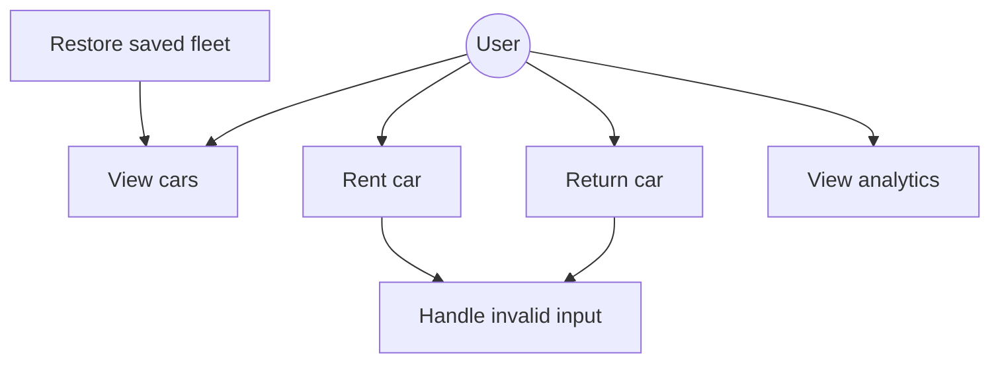

# Use Case Diagram

```mermaid
flowchart TD
    User((User))

    UC1[View cars]
    UC2[Rent car]
    UC3[Return car]
    UC4[View analytics]
    UC5[Restore saved fleet]
    UC6[Handle invalid input]

    User --> UC1
    User --> UC2
    User --> UC3
    User --> UC4
    UC2 --> UC6
    UC3 --> UC6
    UC5 --> UC1
```
