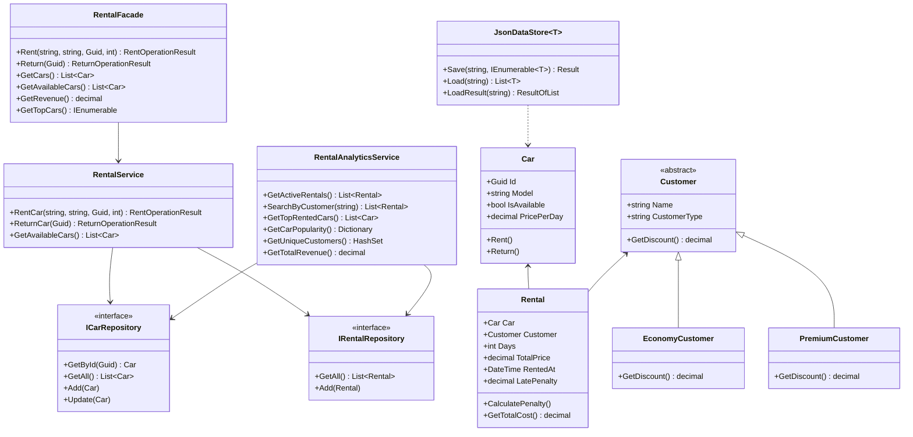

# Class Diagram

```mermaid
classDiagram
    class Car {
        +Guid Id
        +string Model
        +bool IsAvailable
        +decimal PricePerDay
        +Rent()
        +Return()
    }

    class Customer {
        <<abstract>>
        +string Name
        +string CustomerType
        +GetDiscount() decimal
    }

    class EconomyCustomer {
        +GetDiscount() decimal
    }

    class PremiumCustomer {
        +GetDiscount() decimal
    }

    class Rental {
        +Car Car
        +Customer Customer
        +int Days
        +decimal TotalPrice
        +DateTime RentedAt
        +decimal LatePenalty
        +CalculatePenalty()
        +GetTotalCost() decimal
    }

    class RentalService {
        +RentCar(string, string, Guid, int) RentOperationResult
        +ReturnCar(Guid) ReturnOperationResult
        +GetAvailableCars() List~Car~
    }

    class RentalFacade {
        +Rent(string, string, Guid, int) RentOperationResult
        +Return(Guid) ReturnOperationResult
        +GetCars() List~Car~
        +GetAvailableCars() List~Car~
        +GetRevenue() decimal
        +GetTopCars() IEnumerable
    }

    class RentalAnalyticsService {
        +GetActiveRentals() List~Rental~
        +SearchByCustomer(string) List~Rental~
        +GetTopRentedCars() List~Car~
        +GetCarPopularity() Dictionary
        +GetUniqueCustomers() HashSet
        +GetTotalRevenue() decimal
    }

    class ICarRepository {
        <<interface>>
        +GetById(Guid) Car
        +GetAll() List~Car~
        +Add(Car)
        +Update(Car)
    }

    class IRentalRepository {
        <<interface>>
        +GetAll() List~Rental~
        +Add(Rental)
    }

    class JsonDataStore~T~ {
        +Save(string, IEnumerable~T~) Result
        +Load(string) List~T~
        +LoadResult(string) ResultOfList
    }

    Customer <|-- EconomyCustomer
    Customer <|-- PremiumCustomer
    Car <-- Rental
    Customer <-- Rental
    RentalService --> ICarRepository
    RentalService --> IRentalRepository
    RentalFacade --> RentalService
    RentalAnalyticsService --> ICarRepository
    RentalAnalyticsService --> IRentalRepository
    JsonDataStore ..> Car
```
