# Iteration 2 Plan (Lab 35)

## Сценарії, які реалізовані

З backlog реалізовано та розширено такі use cases:

1. оренда автомобіля (розширений сценарій з Lab 34)
2. повернення автомобіля з розрахунком штрафу
3. перегляд доступних автомобілів
4. аналітика оренд (дохід + топ авто)

##  USE CASE 1 — RENT CAR (ОНОВЛЕНО)

Реалізовано повний сценарій:

- перевірка доступності авто
- створення клієнта через Factory
- застосування знижки (economy / premium)
- розрахунок вартості оренди
- створення Rental
- збереження в repository

### Бізнес-правила:
- авто не може бути орендоване двічі
- customerType впливає на знижку
- ціна залежить від `PricePerDay * Days`
- premium клієнт платить менше
- оренда блокує авто

##  USE CASE 2 — RETURN CAR (НОВИЙ)

Реалізовано новий сценарій:

- пошук активної оренди
- повернення авто
- перевірка прострочення
- розрахунок штрафу (1.5x за день)
- фінальний розрахунок вартості

### Бізнес-правила:
- авто можна повернути тільки якщо воно орендоване
- якщо є прострочення → застосовується штраф
- штраф = 1.5 * daily rate * days late
- після повернення авто стає доступним
- кожна оренда має історію

##  USE CASE 3 — VIEW CARS

- показ всіх авто
- фільтр доступності
- відображення ціни за день
- статус (Available / Rented)

##  USE CASE 4 — ANALYTICS (FACADE)

- загальний дохід
- топ найчастіше орендованих авто
- статистика використання системи

# КЛАСИ, ЯКІ БУЛИ ЗМІНЕНІ

## Domain Layer

### Car
- додано `PricePerDay`
- додано логіку оренди/повернення

### Rental
- додано:
  - `TotalPrice`
  - `LatePenalty`
  - `CalculatePenalty()`
  - `GetTotalCost()`

### Customer
- використовується як база для Strategy
- реалізація через Economy / Premium

---

## Application Layer

### RentalService
- додано:
  - `ReturnCar()`
  - повний lifecycle оренди
  - розрахунок штрафів
  - бізнес-правила

### CustomerFactory
- створює клієнтів по типу
- підтримує розширення без зміни сервісу

### RentalFacade (NEW)
- спрощує доступ до системи
- об’єднує:
  - Rent
  - Return
  - Analytics
  - GetCars

## Infrastructure Layer

### CarRepository
- підтримка Update після змін стану

### RentalRepository
- збереження історії оренд

### JsonDataStore
- persistence шар (load/save)

#  НАЙРИЗИКОВАНІШІ СЦЕНАРІЇ

- повернення неіснуючого авто
- подвійне повернення
- прострочення оренди
- некоректний customerType
- втрата даних у JSON
- неконсистентність стану авто

#  ІНТЕГРАЦІЙНІ ТЕСТИ (LAB 36)

## 1. Full flow Rent → Return

- оренда авто
- зміна статусу
- повернення авто
- відновлення доступності

## 2. Pricing correctness

- economy vs premium
- різні дні оренди
- правильний total price

## 3. Penalty system

- без прострочення → 0 штраф
- з простроченням → штраф застосовується

## 4. Repository consistency

- після Save/Load дані не втрачаються
- статус авто коректний

## 5. Facade correctness

- всі операції працюють через Facade
- Console НЕ містить бізнес-логіки

# ПАТЕРНИ ПРОЄКТУ

- Strategy → ціни (economy/premium)
- Factory → створення клієнтів
- Facade → спрощення системи
- Repository → доступ до даних

#  ВИСНОВОК

Система тепер підтримує:

- багатошарову архітектуру
- бізнес-правила
- штрафи та аналітику
- розширюваність без зміни ядра
- патерни проєктування
- повний lifecycle оренди авто
## Демонстрація

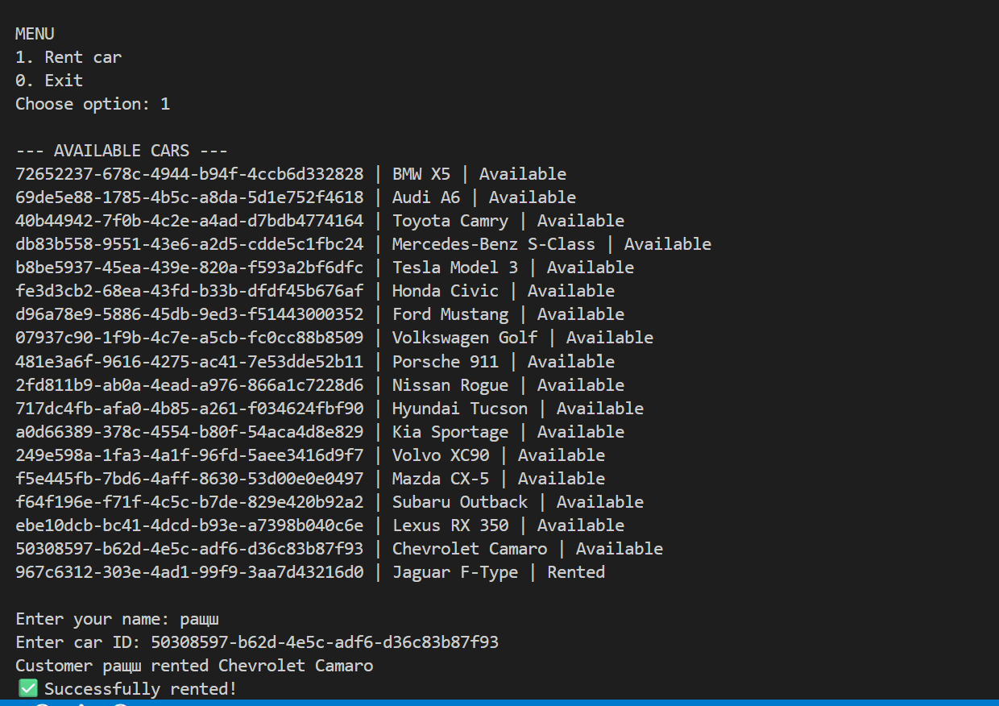
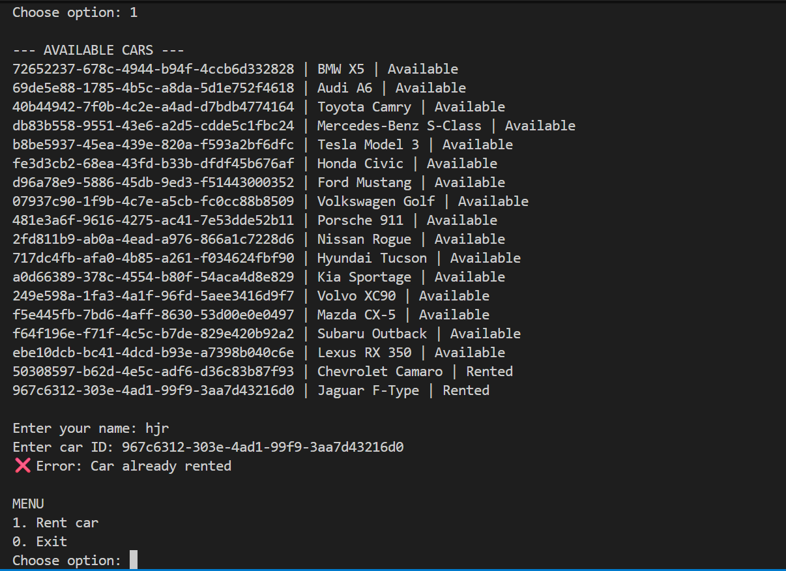
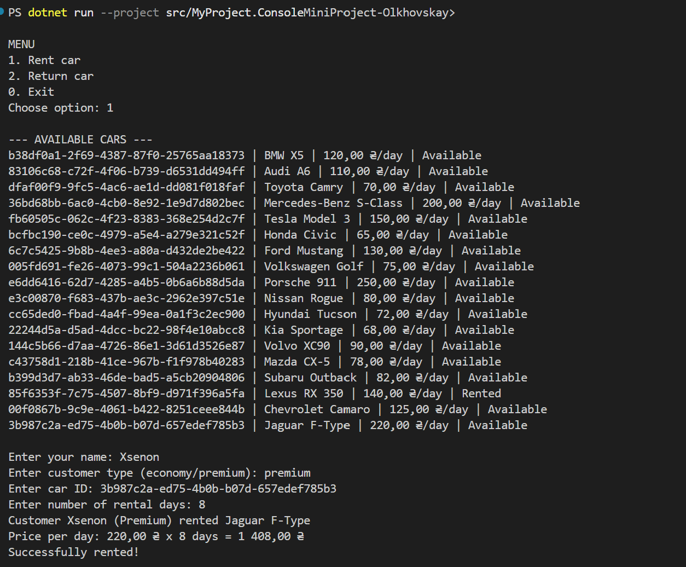
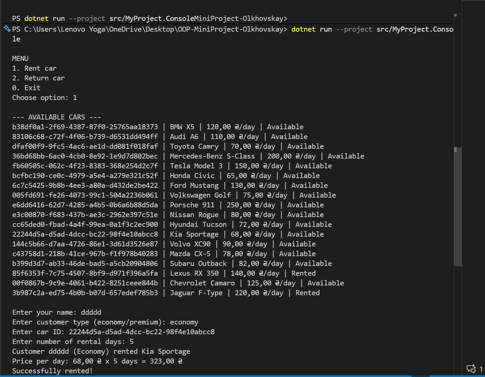
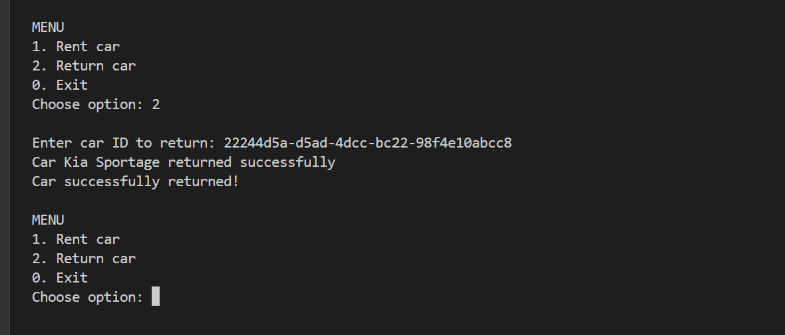
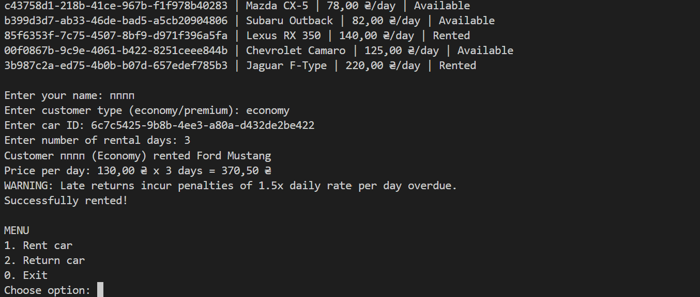
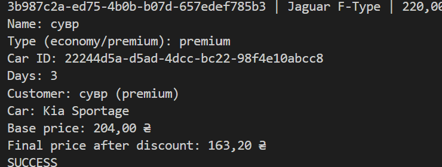
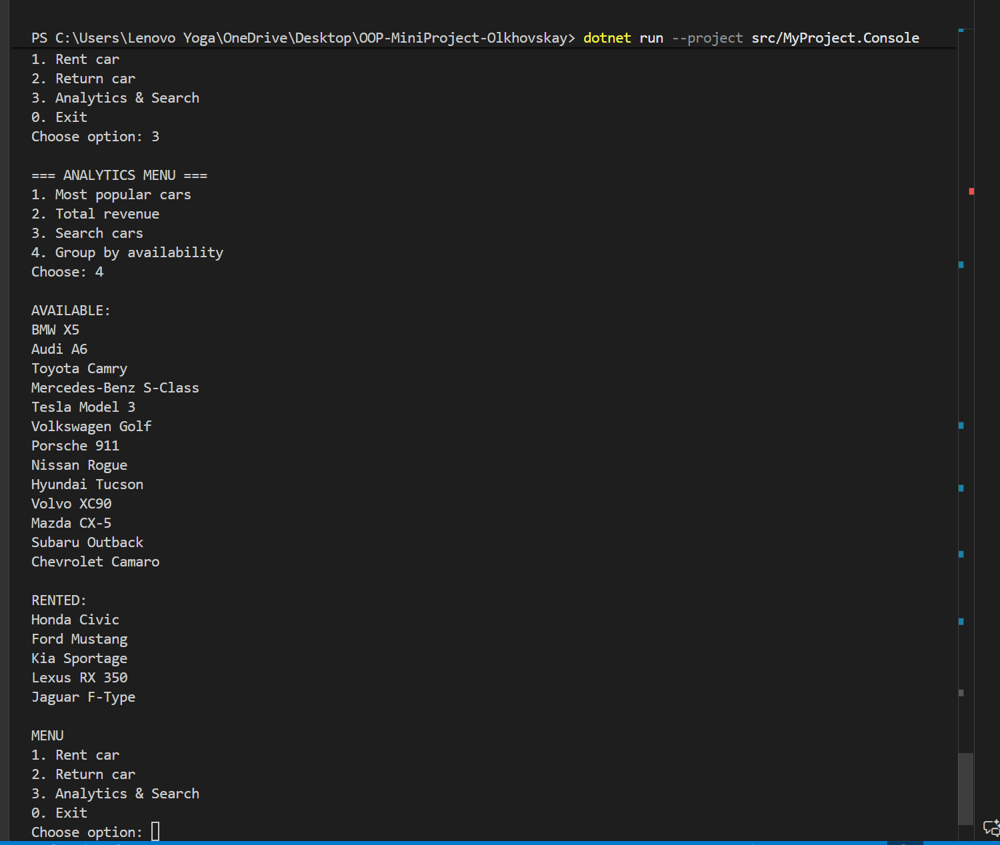
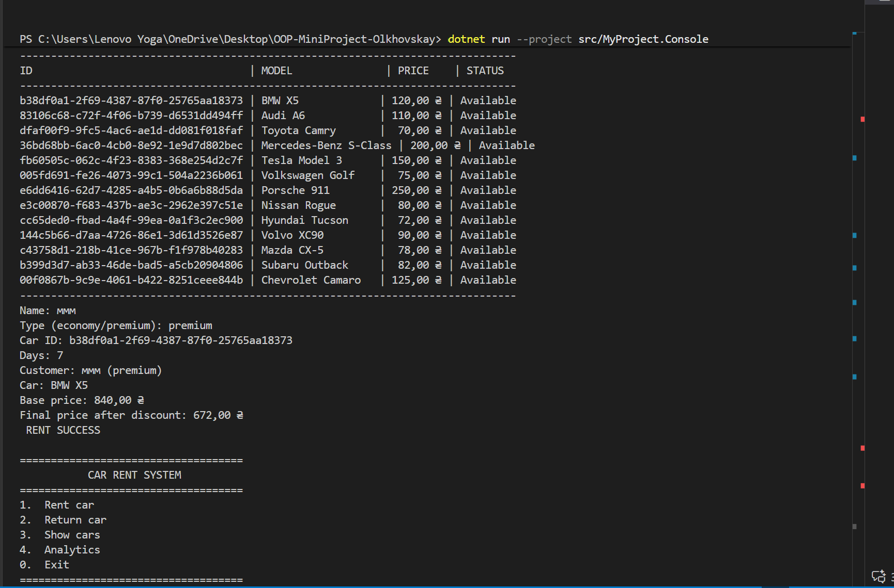
## Демонстрація тести
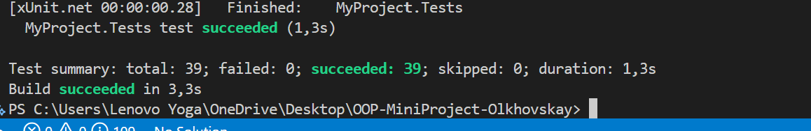
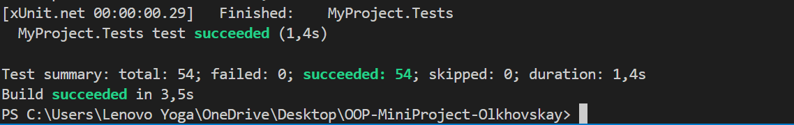