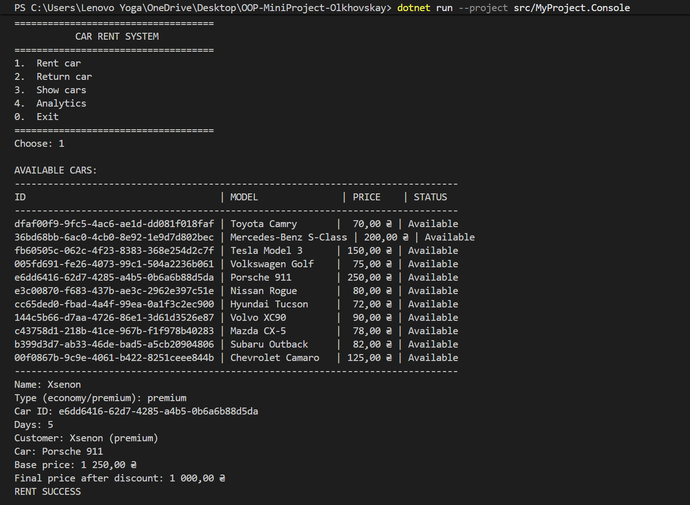
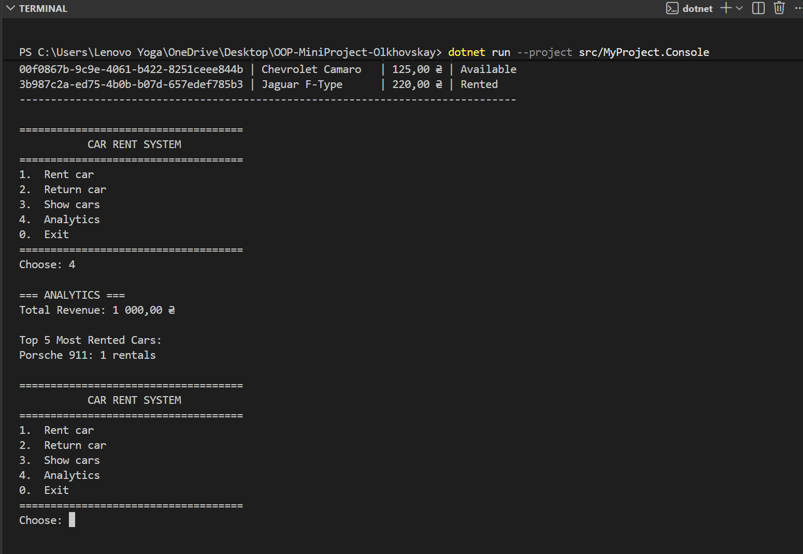

# Iteration 3 Report - Lab 36

## Тема

Quality gate, автоматизоване тестування, fault handling і контроль якості для міні-проєкту оренди автомобілів.

## Що було зроблено

1. Посилено тестованість архітектури:
   - repository contracts розділено на read/write інтерфейси;
   - `RentalService` працює через залежності, які можна замінити в тестах;
   - час винесено в `IDateTimeProvider`;
   - побічні ефекти логування ізольовано через `IEventListener`;
   - ціни авто винесено в `CarPricingConfiguration`.

2. Додано та виправлено unit-тести:
   - доменні інваріанти `Car`, `Rental`, `Customer`, `Money`;
   - boundary values для днів оренди та цін;
   - negative scenarios для domain exceptions;
   - `RentalService`, `RentalFacade`, `CustomerFactory`;
   - `RentalAnalyticsService`;
   - `Result` / `Result<T>`;
   - `ConsoleLogger`, `RentalEventListener`, `ApplicationEventBus`;
   - `FileStorage`, `JsonService`, `JsonDataStore<T>`.

3. Додано інтеграційні перевірки:
   - створення та збереження даних;
   - повторне завантаження з JSON;
   - оренда після restore;
   - повернення після restore;
   - кілька послідовних операцій;
   - missing file;
   - corrupted JSON;
   - invalid save path;
   - logging persistence errors.

4. Додано fault handling:
   - доменні винятки для очікуваних бізнес-помилок;
   - `Result` / `Result<T>` для persistence failures;
   - retry loop у `JsonDataStore.Save`;
   - event logging через `ApplicationEventBus`;
   - graceful fallback для missing/corrupted files.

5. Налаштовано coverage і quality gate:
   - coverlet через `coverlet.msbuild`;
   - OpenCover output;
   - HTML report через ReportGenerator;
   - CI line coverage gate 85%;
   - CI branch coverage gate 80%;
   - artifact `coverage-report`.

## Актуальні метрики

Останній локальний запуск:

```bash
dotnet test tests/MyProject.Tests/MyProject.Tests.csproj --configuration Release --no-restore /p:CollectCoverage=true /p:CoverletOutputFormat=opencover /p:CoverletOutput=TestResults\coverage\ /p:Threshold=85 /p:ThresholdType=line /p:ThresholdStat=total
```

Результат:

| Метрика | Значення |
| --- | ---: |
| xUnit test cases | 212 passed |
| Unit test methods | 168 |
| Integration test methods | 25 |
| Total test methods | 193 |
| Line coverage | 89.87% |
| Branch coverage | 88.04% |
| Method coverage | 88.88% |
| 0% executable classes | 0 |

Модулі:

| Module | Line | Branch | Method |
| --- | ---: | ---: | ---: |
| MyProject.Application | 87.03% | 88.23% | 80.35% |
| MyProject.Domain | 95.96% | 96.66% | 93.87% |
| MyProject.Infrastructure | 86.86% | 78.57% | 96.66% |
| Total | 89.87% | 88.04% | 88.88% |

HTML-звіт: `coverage-report/index.html`.

## Усунені smells

- Великий conditional hotspot для цін авто замінено на dictionary mapping у `CarPricingConfiguration`.
- Прихована залежність від `DateTime.Now` винесена в `IDateTimeProvider`.
- Перевантажені repository contracts розділено на read/write interfaces.
- Консольні побічні ефекти не змішані з доменною логікою.
- Persistence failures більше не ігноруються: вони повертають `Result.Fail` і логуються.
- 0% coverage classes закриті тестами.

## Що залишилось ризикованим перед Lab 37

- `ApplicationEventBus` має глобальний static state. Для більшого проєкту варто додати unsubscribe/reset або перейти на DI-managed event bus.
- `JsonDataStore.Save` має retry, але без configurable delay і без повноцінної resilience policy на кшталт Polly.
- Немає property-based тестів через окрему бібліотеку. Є Theory/fuzz-like boundary checks, але Lab 37 може розширити це FsCheck-підходом.
- Persistence працює з JSON-файлом без file locking strategy для паралельних процесів.
- Консольний UI покритий опосередковано через сервіси, але не має end-to-end тесту введення користувача.
- Варто додати окремий end-to-end тест консольного меню, якщо Lab 37 вимагатиме перевірку саме вводу користувача.

## Демонстрація 






## Висновок

Lab 36 виконана: критична доменна логіка, persistence, fault handling, інтеграційні сценарії, coverage report і CI quality gates підключені. Проєкт готовий як база для фіналізації Lab 37.
