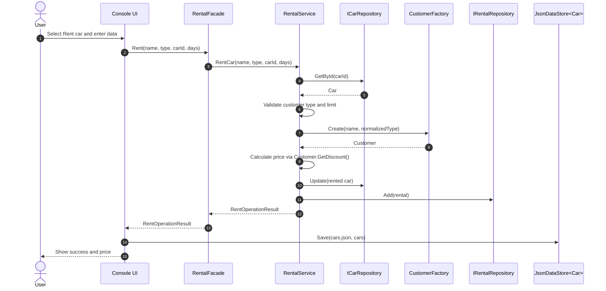

# Rent Car Sequence

```mermaid
sequenceDiagram
    autonumber
    actor User
    participant Console as Console UI
    participant Facade as RentalFacade
    participant Service as RentalService
    participant CarRepo as ICarRepository
    participant Factory as CustomerFactory
    participant RentalRepo as IRentalRepository
    participant Store as JsonDataStore<Car>

    User->>Console: Select Rent car and enter data
    Console->>Facade: Rent(name, type, carId, days)
    Facade->>Service: RentCar(name, type, carId, days)
    Service->>CarRepo: GetById(carId)
    CarRepo-->>Service: Car
    Service->>Service: Validate customer type and limit
    Service->>Factory: Create(name, normalizedType)
    Factory-->>Service: Customer
    Service->>Service: Calculate price via Customer.GetDiscount()
    Service->>CarRepo: Update(rented car)
    Service->>RentalRepo: Add(rental)
    Service-->>Facade: RentOperationResult
    Facade-->>Console: RentOperationResult
    Console->>Store: Save(cars.json, cars)
    Console-->>User: Show success and price
```
